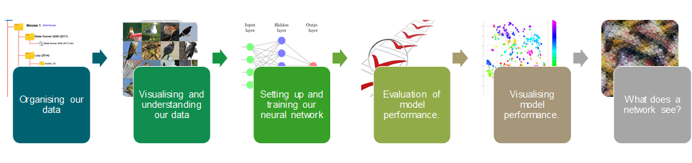

# Image Classification of birds

**A whistle stop tour of how to use the latest image classification techniques to build and understand a deep neural network bird classifier**


This is an investigation using PyTorch CNNs of deep image classificaton to solve a bird species classification problem with the [Caltech UCSD Birds dataset (CUB-200-2011)](http://www.vision.caltech.edu/visipedia/CUB-200.html).

This is a collection of notebooks and tools designed to show how to setup, build, train and evaluate Convolutional Neural Network architectures using PyTorch, Torchvision and other 3rd party packages, to generate state-of-the-art classification results on a fine-grained, long-tailed distribution classification problem. The set of example notebooks will cover the following workflow:



The repository includes a set of example notebooks which walks the user through all the processes required to train and evaluate a network, as well as interrogate what and how the network is making it's decisions through the use of neuron, layer and spatial activations interpretation ([Lucent](https://github.com/greentfrapp/lucent)) and image feature attributions ([Captum](https://captum.ai/)).

We round off the work flow exploration by showing how to convert the PyTorch trained model into an [ONNX (Open Neural Network eXchange)](https://onnx.ai/) format, which enables the bird species classifier to be deployed on vast array of platforms, either in the cloud or on personal devices. We test the ONNX version of the model using the ***ONNX Runtime*** and compare these predictions to the PyTorch version of the model, to show that the inference performance is the same.

# Change Log

## v2.5 Cub tools package installation and environment creation updates

### cub tools package installation

Cub_tools (in pkg/) has now been [published to PYPI](https://pypi.org/project/cub-tools/) and can be easily installed in any environment using following commands:

```shell
pip install cub-tools
```

The head version can still be installed by cloning this repository and running the following:

```shell
cd pkg/

pip install .
```

### Installing a python training environment

An environment file for installing the runtime environment has also been provided.

**This should be run on a machine with the relevant version of the CUDA drivers installed, at current time of writing 11.1. To change the CUDA version, ensure that the cudatoolkit version is correct for the version you have installed, and also check the PyTorch version**. 

It is currently recommended that PyTorch be installed through Conda, as the PYPI versions were not working correctly (_at the time of writing, v1.8.1 when installed through PYPI was causing some computation errors due to linking errors with backend libraries. This was not happening when using Conda installed depdendencies_).

To install an environment using the conda dependencies file, run:

```shell
conda env create -f conda_depdencies.yml
```


## V2.0 Refactoring of training scripts to use YACS YAML configuration files

Training scripts have been completely refactored to use a new Trainer class implementation.

### YACS YAML config files

All configuration and parameters for the model training is now done through YAML configuration files to specify the model configuration.

Examples can be found _scripts/configs_ for the 3 model libraries that are supported by the _cub_tools_ package.

For a complete list of configuration fields, see _pkg/cub_tools/config.py_.

```yaml
# my_project/config.py

MODEL:
    MODEL_LIBRARY: 'timm'
    MODEL_NAME: 'resnext101_32x8d'
DIRS:
    ROOT_DIR: '/home/edmorris/projects/image_classification/caltech_birds'
TRAIN:
    NUM_EPOCHS: 40
```

### New training scripts

Models are trainined by calling the training script and specifying the configuration script.

To train a ResNeXt101_32x8d from the TIMM library, the command run from the scripts directory would be as follows:

```shell
python train_pytorch_caltech_birds.py --config configs/timm/resnext101_32x8d_config.yaml
```

An addition to this release is the integration of PyTorch Ignite training framework to give additional training information. The following features have been implemented.
   1. **Tensorboard logging**. To monitor, simply start Tensorboard with the logging directory watching the models/ directory.
   2. **Model checkpointing**. Saves out the best model after each iteration.
   3. **Early Stopping**. Terminates training if the loss does not improve after a specified number of iterations.

To use these extra features enabled by the PyTorch Ignite framework, run the following:

```shell
python train_pytorch_ignite_caltech_birds.py --config configs/timm/resnext101_32x8d_config.yaml
```

The open-source MLOps system ClearML enables the logging and remote execution of machine learning experiments. It logs everything about a model training, including code status (from the repository), environment dependencies, data and model versions and also training metrics and outputs in an easy to use web based GUI. A version of the training script has been developed to be able to deploy model training via the ClearML system. Note, this version uses Ignite as the framework integrates with ClearML to log training metrics out of the box.

```shell
python train_clearml_pytorch_ignite_caltech_birds.py --config configs/timm/resnext101_32x8d_config.yaml
```

## V1.0 Initial Release

Release of the workshop material with per model training scripts.


# Dataset details and data

## Dataset

Caltech-UCSD Birds-200-2011 (CUB-200-2011) is an extended version of the CUB-200 dataset, with roughly double the number of images per class and new part location annotations. For detailed information about the dataset, please see the technical report linked below.


Number of categories: 200

Number of images: 11,788

Annotations per image: 15 Part Locations, 312 Binary Attributes, 1 Bounding Box

Some related datasets are Caltech-256, the Oxford Flower Dataset, and Animals with Attributes. More datasets are available at the Caltech Vision Dataset Archive.

## Data files

To download the data click on the following links:

   1. Images and annotations [CalTech Visipedia Website - CUB_200_2011.tgz](http://www.vision.caltech.edu/visipedia-data/CUB-200-2011/CUB_200_2011.tgz)
   
   **The image tarball should be downloaded to repository root, and extracted into the data/images_orig sub-directory, as shown below.***
               
    
   2. Segmentations (optional, not need for this work) [CalTech Visipedia Website - segmentations.tgz](http://www.vision.caltech.edu/visipedia-data/CUB-200-2011/segmentations.tgz)
    
Place the files into the root of the cloned caltech_birds repo file structure.

Unzip the dowloaded zip files into cloned repository structure that replicates the project structure:

    caltech_birds-|
        data-|   ** SEPARATE DOWNLOAD FROM CALTECH VISIPEDIA WEBSITE **
            attributes-|
            images_orig-|   ** RENAME IMAGES FOLDER TO IMAGE_ORIG **
               ##class_name##-|
                  class001-image001.jpg
                  class001-image002.jpg
            images-|   ** NEW FOLDER CREATED BY FIRST WORKFLOW PROCESS **
               train-|
                  ##class_name##-|
                     class###-image001.jpg
               test-|
                  ##class_name##-|
                     class###-image035.jpg
            parts-|
            attributes.txt
            bounding_boxes.txt
            classes.txt
            image_class_labels.txt
            images.txt
            README
            train_test_split.txt
        example-notebooks-|   ** WORKSHOP MATERIAL IS IN HERE **
        models-|   ** SEPARATE DOWNLOAD FROM RELEASES **
            classification-|
                #modelname1#-|
                #modelname2#-|
        notebooks-|      ** INVESTIGATIONS OF ALL TYPES OF CNN ARCHITECTURES ON THE BIRD CLASSIFICATION PROBLEM **
        pkg-|            ** CUB_TOOLS PYTHON PACKAGE. INSTALL FROM IN HERE.
        scripts-|        ** TRAINING SCRIPTS FOR PYTORCH CNN MODELS **


# Workshop walk-through notebooks series

**example_notebooks directory contains the walk-through workshop notebooks**, for following the full workflow of producing a bird classifier using deep neural networks, using a ResNet152 deep neural network architecture.

See below on the requirements for installing and using the notebooks, as  well details of the additional folders including more CNN architecture investigations using the CUB-200-2011 dataset.


# Installation

For installation notes, [see package installation notes](https://github.com/ecm200/caltech_birds/blob/master/pkg/readme.md).

# Additional files
        
**notebooks** directory contain the Jupyter notebooks where the majority of the visualisation and high level code will be maintained.

**scripts** directory contains the computationally intensive training scripts for various deep CNN architectures, which take longer to run (even on GPU) and are better executed in a python script. I suggest this be done using some form of terminal persistance method (if running in the cloud) to keep the terminal session open whilst the model is training, allowing you to log off the remote host without killing the process. These can typically take a few hours, to a day or so to complete the prescribed epochs. I prefer to use [TMUX](https://github.com/tmux/tmux/wiki/Getting-Started), which is a Linux utility that maintains separate terminal sessions that can be attached and detached to any linux terminal session once opened. This way, you can execute long running python training scripts inside a TMUX session, detach it, close down the terminal session and let the process run. You can then start a new terminal session, and then attach the running TMUX session to view the progress of the executed script, including all its output to terminal history.

**pkg** directory contains all the utility functions that have been developed to process, visualise, train and evaluate CNN models, as well results post processing have been contained. It has been converted into a python package that can be installed in the local environment by running in the **pkg** directory, *pip install -e .*. The functions can then be accessed using the cub_tools module import as ***import cub_tools***.

**models** directory contains the results from the model training processes, and also any other outputs from the evaluation processes including model predictions, network feature maps etc. **All model outputs used by the example notebooks can be downloaded from the release folder of the Github repo.** The models zip should be placed in the root of the repo directory structure and unziped to create a models directory with the ResNet152 results contained within. Other models are also available including PNASNET, Inception V3 and V4, GoogLenet and ResNeXt variants.
